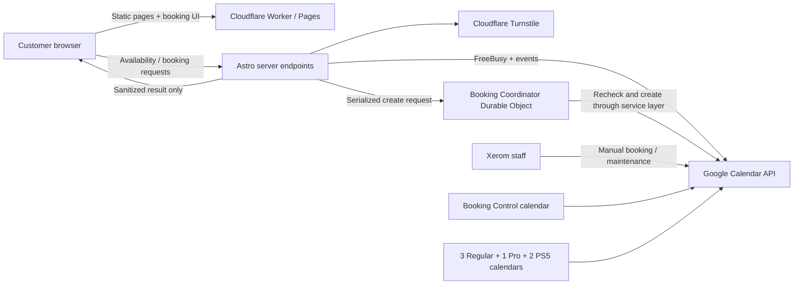

# Booking Architecture

Status: approved planning architecture; implementation details must be verified against deployed Cloudflare and Google environments.

## System boundaries

Cloudflare requires the SQLite Durable Object to live in a separately deployed Worker and be bound to the public website Worker (or Pages project). This is an extra deployable, not a traditional server or booking database.

## Calendar model

Private calendars:

- `XEROM — Regular Sim 01`
- `XEROM — Regular Sim 02`
- `XEROM — Regular Sim 03`
- `XEROM — Pro Sim 01`
- `XEROM — PS5 Lounge 01`
- `XEROM — PS5 Lounge 02`
- `XEROM — Booking Control`

Every opaque/busy event on a resource calendar blocks that complete interval, regardless of who created it. Control-calendar events block the venue according to the convention later documented in `BOOKING_OPERATIONS.md`.

Calendar IDs are referenced only through server-side environment bindings. The browser receives service names and aggregate capacity, never calendar IDs or event content.

## Public API shape

### `GET /api/availability`

Inputs: local date, requested line items (`regularSim`, `proSim`, or `ps5` quantities), and duration of 60 or 120 minutes.

The endpoint validates the three-day horizon and one-hour notice, builds the relevant Asia/Kuala_Lumpur interval, applies opening/control-calendar constraints, queries FreeBusy for all candidate resources, and returns start times with aggregate capacity by tier. It returns no event metadata or personal data.

### `POST /api/bookings`

Inputs: selected line items, duration, start time, customer name, mobile number, optional notes, Turnstile token, and idempotency key.

The endpoint enforces request size and content type, validates/sanitizes fields, verifies same-origin policy where applicable, verifies Turnstile, derives authoritative price and end time, and forwards a normalized command to the booking coordinator. The coordinator rechecks all calendars, allocates resources, and creates events.

Responses:

- `201` complete confirmed booking.
- `200` replay of the same completed idempotent request.
- `400` invalid request.
- `403` origin/Turnstile rejection.
- `409` slot no longer available or idempotency-key payload mismatch.
- `429` rate limited.
- `502/503` sanitized external dependency failure.

## Availability and allocation

1. Convert the requested local start to an absolute instant using `Asia/Kuala_Lumpur`; never calculate rules from the edge location’s timezone.
2. Require start at least one hour from now and no more than three calendar days ahead under the final owner-approved horizon convention.
3. Confirm the complete 60- or 120-minute interval lies inside the overnight business window.
4. Reject any overlap with the Booking Control calendar.
5. Query busy intervals for all candidate calendars.
6. A resource is eligible only when no busy interval overlaps any part of the requested interval.
7. Allocate deterministically by configured resource order within each requested tier.
8. Mixed sim requests allocate the requested Regular and Pro quantities as separate line items under one booking ID.
9. Never substitute a Pro rig for a Regular request or vice versa unless a future owner-approved rule explicitly allows it.

Overlap uses half-open intervals: `[start, end)`. Therefore an event ending at 8:00 PM does not conflict with one starting at 8:00 PM, enabling confirmed back-to-back sessions.

### Manual owner booking policy update — 2026-09-16

Race Control/manual owner requests use the same Calendar authority, serialization, resource allocation and three-day horizon, but may start at any minute in the future and may use 30, 60 or 120 minutes without the customer-facing one-hour notice floor. Public customer requests retain the currently confirmed 60/120-minute and one-hour-notice policy until it is explicitly changed and published. Manual requests still must fit configured opening hours and cannot overlap busy resource or Booking Control events.

## Concurrency strategy

All create operations route through one named booking-coordinator Durable Object for the MVP. Xerom’s scale favors simple global serialization over fragile per-slot locking, and it safely covers mixed-tier allocations and overlapping one-/two-hour requests. Availability reads remain direct and concurrent; only final booking creation is serialized.

Inside one coordinator request:

1. Check idempotency state.
2. Re-query the control and candidate resource calendars.
3. Allocate every requested resource for the complete interval.
4. Create all Calendar events with deterministic identifiers and shared booking metadata.
5. Mark the idempotency attempt complete only after every event succeeds.
6. Return the sanitized confirmation.

The coordinator may retain short-lived attempt state for safe retries. This is coordination metadata, not the booking system of record; Google Calendar remains authoritative for bookings and staff operations.

## Idempotency

The browser creates a cryptographically random attempt key before final submission and reuses it for retries of the same review payload. The server stores a hash of the normalized payload with short-lived state in the coordinator. Reusing a key with different input returns `409`.

Each resource event uses a deterministic Google-compatible event ID derived from the booking attempt and resource identity. This provides a second duplicate barrier if a network response is lost after Google creates an event. Private extended properties include the attempt hash, booking ID, resource ID, service type, duration, quantity, status, source, and creation timestamp.

The implementation must confirm Google event-ID format constraints and retention periods in tests before finalizing this scheme.

## Event model

Example title:

`XR-7K2F | REGULAR SIM | Aaron | 60m`

Example private description content for staff:

- Customer name and phone.
- Service and resource quantity.
- Start/end and duration.
- Authoritative total price and promotion applied, if any.
- Booking ID and `xerom.my` source.
- Optional sanitized notes.

Private extended properties use compact string values and include:

- `bookingId`
- `attemptHash`
- `source`
- `serviceType`
- `resourceId`
- `durationMinutes`
- `quantity`
- `status`
- `createdAt`

Customer data need not be duplicated into extended properties when the searchable staff description already carries it. All calendars remain private.

## Multi-resource creation and rollback

Events are created sequentially in deterministic order. The coordinator records each successful event ID during the attempt. If a later insert fails, it deletes every event created for that attempt on a best-effort basis and returns failure—never partial success.

If rollback itself fails, the response remains a failure and server logs emit a high-severity reconciliation record containing only operational identifiers needed by staff. The attempt remains recoverable and must not be blindly retried into duplicate events. The staff runbook will define how to find the shared booking ID and remove orphan events.

## Price calculation

The server derives price from versioned configuration:

- Regular Sim: RM20 per rig-hour.
- Pro Sim: RM30 per rig-hour.
- PS5: RM18 per lounge-hour including two controllers.
- Additional PS5 controllers: RM3 each, subject to an owner-confirmed maximum.

The total is the sum of each line item multiplied by duration hours, plus configured add-ons, followed by an explicitly active promotion rule. The browser never submits a trusted total. A booking event records both the amount and a pricing-configuration version so later price edits do not obscure what the customer saw.

## Authentication and secrets

Use a dedicated Google service account for server-to-server authentication. Share only the Xerom resource/control calendars with that identity and grant **Make changes and see event details** (the minimum Google role that can create/delete the private opaque events used for bookings; do not grant manage-sharing access). Store the service-account email/private key, Turnstile keys, and calendar IDs as encrypted Cloudflare configuration. Never commit a service-account JSON file.

Expected names will be finalized during implementation and documented in `.dev.vars.example` and `GOOGLE_CALENDAR_SETUP.md`.

## Security and privacy

- Validate all public inputs with a shared server schema and strict allowlists.
- Enforce small JSON bodies, normalized Malaysian phone input, escaped/sanitized notes, and length limits.
- Verify Turnstile server-side and apply Cloudflare rate limiting to availability and booking endpoints.
- Use generic customer-facing errors and structured server logs without raw credentials or unnecessary personal data.
- Add security headers and a restrictive content security policy compatible with Turnstile.
- Keep analytics events free of names, numbers, notes, booking IDs, dates, times, and resource selections.

## Cancellation and rescheduling

MVP cancellation/rescheduling happens through WhatsApp. Staff search the private calendars using the booking ID and update or delete every event sharing that ID. No public mutation endpoint is required. Future signed management links may be added without changing the Calendar record model.

## Required acceptance tests

- Regular, Pro, PS5, mixed-tier, multi-resource, and two-hour bookings.
- Manual event, maintenance event, and full-venue closure blocking.
- Overnight hours and Asia/Kuala_Lumpur boundary behavior.
- One-hour notice and three-day horizon edges.
- Exact adjacency allowed; partial overlap rejected.
- Two simultaneous requests for the final resource: exactly one `201`, one `409`.
- Duplicate submit and lost-response retry create no additional events.
- Partial insert failure removes previously created events.
- Rollback failure is logged and never returned as success.
- Turnstile, Google auth, rate limit, malformed input, timeout, and network failure states.

## 2026-09-15 — Planned Race Control extension

The owner has expanded scope beyond the original Calendar-only staff workflow. [Race Control plan](docs/RACE_CONTROL_PLAN.md) specifies owner-authenticated booking mutations, runtime versioned configuration, resource provisioning, pricing conflict rules, hours impact review and recovery journals/fences. Its expanded API/storage/operating model supersedes the corresponding original planning boundaries above; serialization, private calendars, authoritative pricing, idempotency and no-partial-success requirements remain mandatory.

Key additions: all app mutations share venue coordinator ordering; configuration is resolved and validated inside final booking operations; grouped edits use conditional Calendar versions and safe compensation; incomplete recovery fences capacity. Google UI edits bypass application serialization and must be detected/reconciled rather than described as protected by the app lock. R2 config/media and DO recovery state are proposed support storage, not a second permanent booking database.

Calendar provisioning uses venue-owner authorization, since the current event-writer service account has not been proven suitable for owned-calendar lifecycle operations. Creation/deletion require explicit reviewed owner confirmation. Retire preserves history; deletion of nonempty calendars waits on retention policy. No new Calendar actions have been performed by this planning change.
